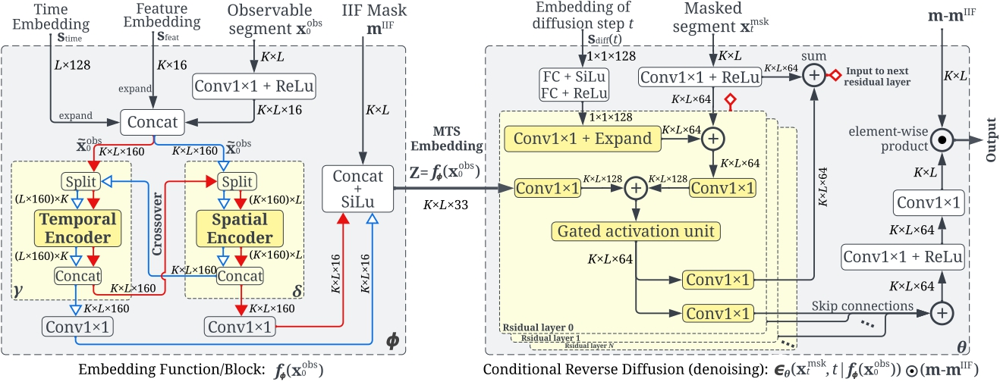

<div align="center">


**Self-Supervised Learning of Time Series Representation via Diffusion Process and Imputation-Interpolation-Forecasting Mask**

<p align="center">
  <!-- <a href="https://github.com/ZinebSenane/TSDE/blob/main/LICENSE">
    
  </a> -->
  <a href="https://github.com/ZinebSenane/TSDE/blob/main/LICENSE">
    
  </a>
  <a href="https://arxiv.org/abs/">
    
  </a>
</p>

------
<p align="center">
  <a href="#tsde-training-and-evaluation">Usage</a> •
  <a href="#examples">Examples</a> •
  <a href="#checkpoints">Checkpoints</a> •
  <a href="https://storage.googleapis.com/motherbrain-tsde/Datasets.zip">Processed Datasets</a> •
</p>
</div>


> Time Series Diffusion Embedding (TSDE), bridges the gap of leveraging diffusion models for Time Series Representation Learning (TSRL) as the first diffusion-based SSL TSRL approach. TSDE segments time series data into observed and masked parts using an Imputation-Interpolation-Forecasting (IIF) mask. It applies a trainable embedding function, featuring dual-orthogonal Transformer encoders with a crossover mechanism, to the observed part. We train a reverse diffusion process conditioned on the embeddings, designed to predict noise added to the masked part. Extensive experiments demonstrate TSDE’s superiority in imputation, interpolation, forecasting, anomaly detection, classification, and clustering. 





## Usage

We recommend to start with installing dependencies in an virtual environment.
```
conda create --name tsde python=3.11 -y
conda activate tsde
pip install -r requirements.txt
```

### Datasets
Download public datasets used in our experiments:

```
python src/utils/download_data.py [dataset-name]
```
Options of [dataset-name]: physio, pm25, electricity, solar, traffic, taxi, wiki, msl, smd, smap, swat and psm

### Imputation

To run the imputation experiments on PhysioNet dataset:
```
python src/experiments/train_test_imputation.py --device [device] --dataset PhysioNet --physionet_classification True --testmissingratio [test_missing_ratio]
```
In our experiments, we set [test_missing_ratio] to: 0.1, 0.5, and 0.9

To run the imputation experiments on PM2.5 dataset, first set train-epochs to 1500, and finetuning-epochs to 100 in src/config/base.yaml, and run the following command:
```
python src/experiments/train_test_imputation.py --device [device] --dataset Pm25 
```

### Interpolation
To run the imputation experiments on PhysioNet dataset:
```
python src/experiments/train_test_interpolation.py --device [device] --dataset PhysioNet --physionet_classification True --testmissingratio [test_missing_ratio]
```
In our experiments, we set [test_missing_ratio] to: 0.1, 0.5, and 0.9

### Forecasting
Please first set the number of pretraining and finetuning epochs for each dataset in src/config/base_forecasting.yaml, and set the number of features for subsampling training in the TSDE_forecasting model in src/model/main_model.py.
Run the following command:
```
python src/experiments/train_test_forecasting.py --dataset [dataset-name] --device [device] 
```

### Anomaly Detection
Please first set the number of features, the number of pretraining and finetuning epochs for each dataset in src/config/base_ad.yaml.
Run the following command:
```
python src/experiments/train_test_anomaly_detection.py --dataset [dataset-name] --device [device] --seed [seed] --anomaly_ratio [anomaly_ratio]
```

The values of [dataset-name], [seed] and [anomaly_ratio] used in our experiments are available in our paper.

### Classification on PhysioNet
Run the following command:
```
python src/experiments/train_test_classification.py --seed [seed] --device [device] --testmissingratio [test_missing_ratio]
```

## Examples
#### Examples of imputation, interpolation and forecasting


#### Example of clustering


#### Example of embedding visualization


## Checkpoints
To run the evaluation using a specific checkpoint, follow the instructions below. Ensure your environment is set up correctly for running and the datasets are downloaded first.
### Imputation
1. **Download the checkpoints**: Access and download the required checkpoints from [here](https://storage.googleapis.com/motherbrain-tsde/Checkpoints/Imputation.zip). Place the content of this folder under [root_dir]/save.
2. **Run the evaluation command** by setting `[path_to_checkpoint_folder]` accordingly. The path should excludes '[root_dir]/save' and 'model.pth'.
```
python src/experiments/train_test_imputation.py --device [device] --dataset PhysioNet --physionet_classification True --testmissingratio 0.1 --modelfolder [path_to_checkpoint_folder] --run [run_number]
```
```
python src/experiments/train_test_imputation.py --device [device] --dataset Pm25 --modelfolder [path_to_checkpoint_folder] --run [run_number]
```

### Interpolation
1. **Download the checkpoints**: Access and download the required checkpoints from [here](https://storage.googleapis.com/motherbrain-tsde/Checkpoints/Interpolation.zip). Place the content of this folder under [root_dir]/save.
2. **Run the evaluation command** by setting `[path_to_checkpoint_folder]` accordingly. The path should excludes '[root_dir]/save' and 'model.pth'.
```
python src/experiments/train_test_interpolation.py --device [device] --dataset PhysioNet --physionet_classification True --testmissingratio 0.1 --modelfolder [path_to_checkpoint_folder] --run [run_number]
```
### Forecasting
1. **Download the checkpoints**: Access and download the required checkpoints from [here](https://storage.googleapis.com/motherbrain-tsde/Checkpoints/Forecasting.zip). Place the content of this folder under [root_dir]/save.
2. **Run the evaluation command** by setting `[path_to_checkpoint_folder]` accordingly. The path should excludes '[root_dir]/save' and 'model.pth'.
```
python src/experiments/train_test_forecasting.py --device [device] --dataset [dataset-name] --modelfolder [path_to_checkpoint_folder] --run [run_number]
```

### Anomaly Detection
1. **Download the checkpoints**: Access and download the required checkpoints from [here](https://storage.googleapis.com/motherbrain-tsde/Checkpoints/Anomaly_Detection.zip). Place the content of this folder under [root_dir]/save.
2. **Run the evaluation command** by setting `[path_to_checkpoint_folder]` accordingly. The path should excludes '[root_dir]/save' and 'model.pth'.
```
python src/experiments/train_test_anomaly_detection.py --device [device] --dataset [dataset-name] --modelfolder [path_to_checkpoint_folder] --run [run_number] --disable_finetune
```

### Classification
1. **Download the checkpoints**: Access and download the required checkpoints from [here](https://storage.googleapis.com/motherbrain-tsde/Checkpoints/Classification.zip). Place the content of this folder under [root_dir]/save.
2. **Run the evaluation command** by setting `[path_to_checkpoint_folder]` accordingly. The path should includes '[root_dir]/save' and excludes 'model.pth'.
```
python src/experiments/train_test_classification.py --device [device] --modelfolder [path_to_checkpoint_folder] --run [run_number] --disable_finetune
```

